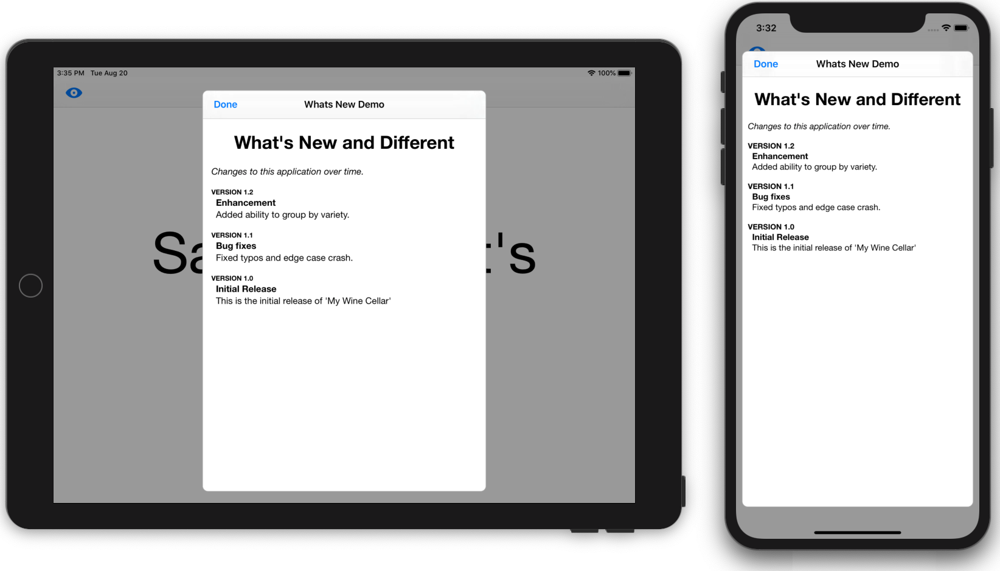

# Whats New Template for iOS/Swift
A template for displaying new features (and past feature additions) to your app.
The What's New screen will be displayed over the entire context of your application so if your app supports a split view controller, the What's new screen will be displayed modally over both views.  To preserve a reasonable appearance on an iPad, the **maximum width** of the Whats's New screen will be 500px.



## How To Present What's New
The original intent of What's new was to only present the screen once for every new build installed.  If this is how you wish to use it, simply add the following to the **ViewDidAppear()** of your initial screen.
```swift
WhatsNew.showWhatsNew(on: self)
```
When this function is called, it checks the version and build number of your app and compares it to a string stored in UserDefaults.  If it is not found, or does not match the currently running app, the What's New screen will be displayed.  
When the screen is dismissed, the current version and build number of your app is stored and will thus prevent the display of What's new in future launches.

If you wish to display whats new on demand, you can assign it to an action on a button.  If this is the case, use the following:
```swift
 WhatsNew.showWhatsNew(on: self, conditional: false)
 ```
 ## How to install
 Simply copy the entire **WhatsNewStuff** folder into your project and edit the **WhatsNewItemBuilder.swift** file as described below.
 
## How to add your own What's New content
Edit the **WhatsNewItemBuilder** class file by editing the **BuildWhatsNew()** class.  Edit the title and intro strings and then by add any number of WhatsNewItems.
Here is an example

```swift
class WhatsNewItemBuilder {
    static func BuildWhatsNew() -> WhatsNew {
        let whatsNew:WhatsNew = WhatsNew()
        
        // *********** Enter your What's New data here
        
        // Title and Intro
        whatsNew.title = "What's New"
        whatsNew.intro = "Thank you for using the What's New Template. This latest version includes enhancements and bug fixes."
        
        // Add a new item for each version.  Add the NEWEST version on the end of the array as the html will read the items
        // in reverse order to show the latest build first.
        let newItem1 = WhatsNewItem(version: "1.0.1",
                                    versionTitle: "Initial Release",
                                    description: "This is the initial release.  Feedback to slynch@createchsol.com would be appreciated")
        let newItem2 = WhatsNewItem(version: "1.0.2",
                                    versionTitle: "New Feature: On Demand Button",
                                    description: "Added an 'On Demand' button on initial ViewController to demonstrate syntax for on demand presentation.")
        let newItem3 = WhatsNewItem(version: "1.0.3",
                                    versionTitle: "New Feature: Line Breaks", description: "Adding abilility to add line breaks.\nLike this.")
        whatsNew.items = [newItem1,newItem2,newItem3]
        
        // *********** End of your entry
        
        return whatsNew
        
    }
    
}

```
## Modifying the text styles and appearance
The content of the What's New screen is simply html text rendered in a **WKWebView**.  The styling is controlled by the CSS styles defined in **styles.css**.  To modify the style of the content, simply edit this file.
```css
body {
    font-family: "Helvetica Neue", sans-serif;
    font-size: 3em;
    padding-left: 0.5em;
    padding-right: 0.5em;
    color: #333333;
}

h1 {
    font-weight: bold;
    text-align: center;
}

.intro {
    font-style: italic;
}

.version {
    padding-top: 1.5em;
    font-weight: bold;
    text-transform: uppercase;
    font-size: .75em;
}
.versionTitle {
    font-weight:bold;
}

.description,.versionTitle {
    padding-left: 0.5em;
}
```

## Modifying the navigation bar
You can modify the appearance of the navigation bar and tint color by editing the **WhatsNewViewController.swift** file.
For example, you can uncomment some or all of the appearance properites and edit them to your liking.
```swift
//        navigationBarAppearance.barStyle = .black
//        navigationBarAppearance.isTranslucent = true
//        navigationBarAppearance.tintColor = UIColor.white
//        navigationBarAppearance.barTintColor = UIColor(red: 94/255, green: 54/255, blue: 105/255, alpha: 1)
//        navigationBarAppearance.titleTextAttributes = [NSAttributedString.Key.foregroundColor:UIColor.white]
```


